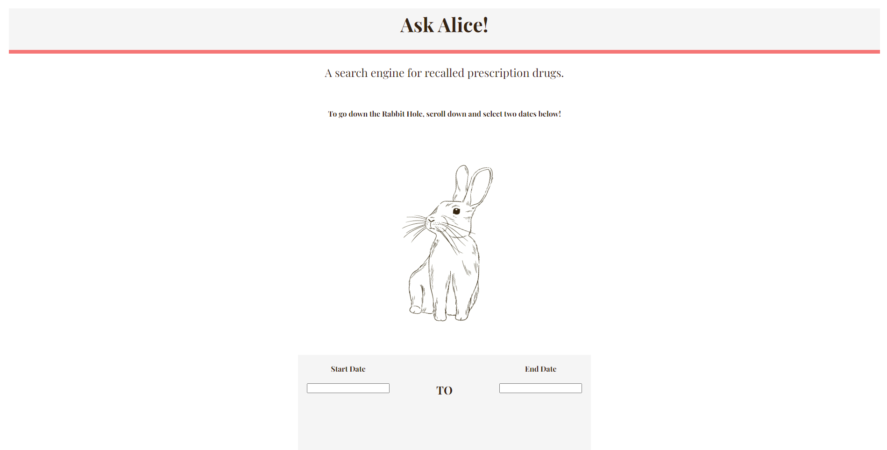
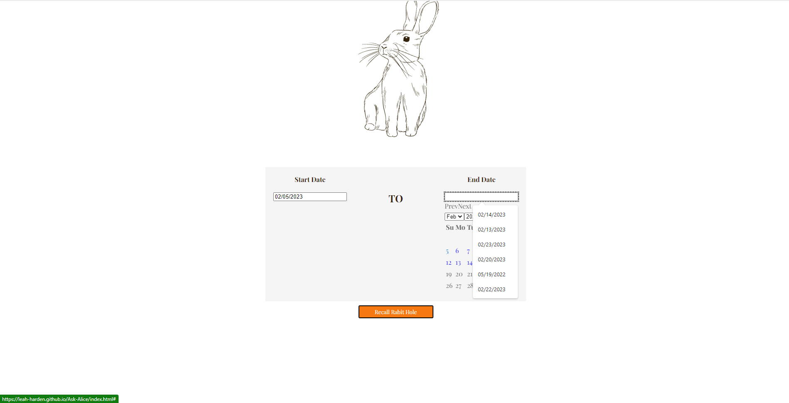
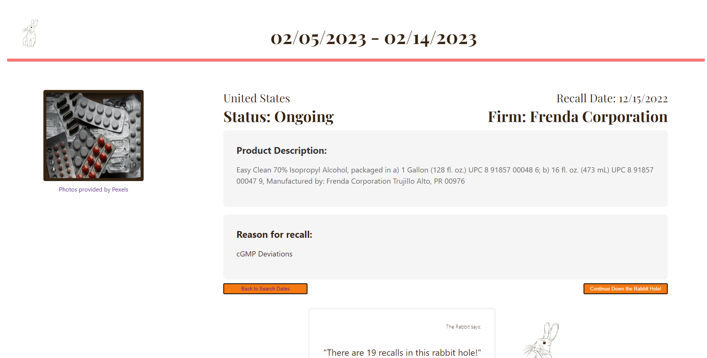
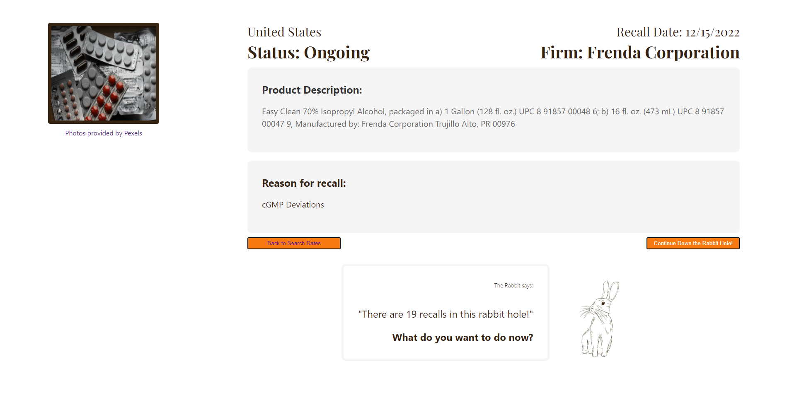

# Ask Alice: A Recall Rabbit Hole

## Description

For the first group project, we were tasked with developing an interactive front-end web application that uses two different server side API's. We came up with a search engine that fetches from the FDA's API to display information on a range of recalled prescription drugs, and then we fetch from Pexel API to generate random images that accompany the drug information.

The Acceptance Criteria is as follows:

GIVEN the user is trying to research a drug to see it's recall history

WHEN they select a certain date range and clicks the Rabbit Hole search button

THEN the user is presented with random information from medicine that was selected in that time frame which includes recall status, reason for the recall and the parent company associated with the recall.

WHEN the user reloads the page or clicks the back button

THEN the drugs that the user has searched in the past will be suggested beneath the search bar

## Usage

Ask-Alice is a website for consumers to research any medicines that have been recalled for over the last few years.

The consumer will select a start and end date which will then take them to the results that will give them 1 generated recall within that timeframe. What's then displayed on the page is a brief description of the product, a reason for the recall, the date of the recall, the number of recalls during that time frame, and the parent company where the medicine was produced.

The consumer can then chose to click the continue down the rabbit hole button that will generate another medicine that was recalled within the timeframe that they previously selected.

Or the back to search button can be clicked that will take them to Ask Alice homepage where a new range of dates can be selected and the consumer can then reenter the rabbit hole.

## Screenshots

## Credits

#### Developers

Leah Harden: HTML, CSS

Daniel Oliva Figueroa: JavaScript

Andrew Bock: HTML, CSS

Dynashia Lewis: Pexels API, README

#### Utilized Technologies

HTML/CSS/Javascript

FDA API

Pexels API

UI Kit

DayJS

jQuery

## License

N/A

